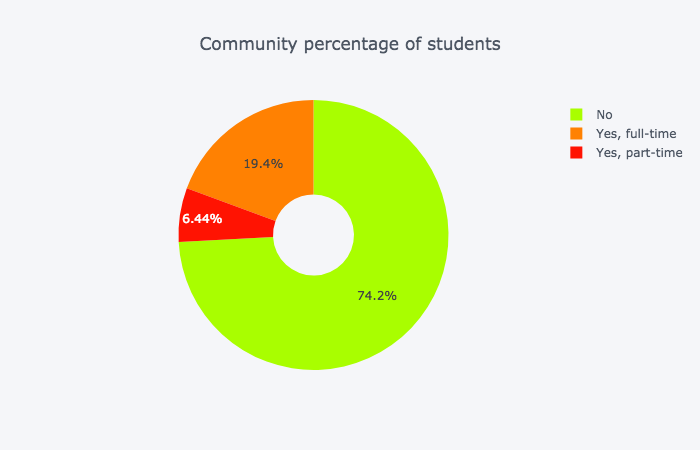
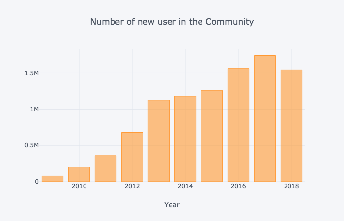
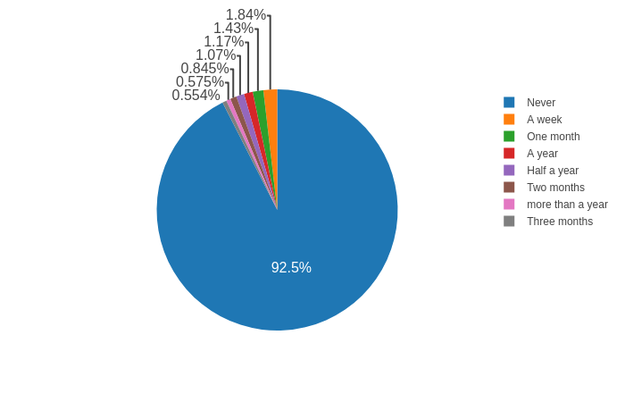
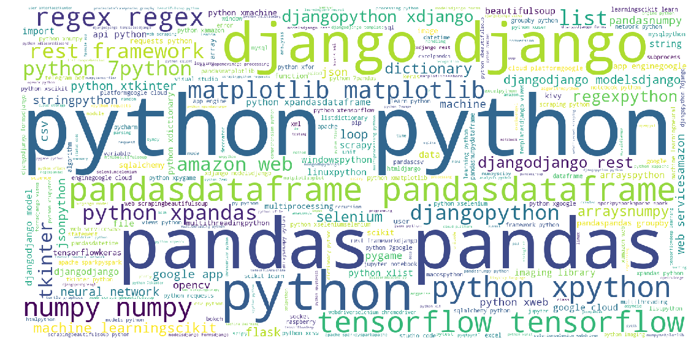

# StackOverflow-datascience-atlas (SODA)

StackOverflow is the largest online community for programers to learn, share their knowledge, and advance their career.

StackOverflow-data science-atlas (SODA)
The project "SODA" is intended to build language facilitation app for both new registers and coding gurus to format their questions on StackOverflow. According to the exploration data analysis [(Link)](https://www.kaggle.com/zehaiwang/stackoverflow-preliminary-eda), less than 10% of new registers from 2017-18 post question  within one-year, what is more, only 3.6% percent of their posted question got accepted answers. This indicating, we should provide more insight suggestions and assistance for newbies to make them truly taking advantage of the community. Detailed data queries can be found in [this notebook](https://github.com/wangz19/Stack-overflow-datascience-atlas/blob/master/notebook/preliminary_query.ipynb)

The project uses of 160GB metadata of over 30 million post questions/answers from open-source database (2008 - Mar, 2018). The database is available on Google’s BigQuery cloud data warehouse, that kaggle provide monthly free quota to query data. Supplementary data are queried from Stack Overflow's official API and other open source survey. 

According to the recent [2018 survey](https://www.kaggle.com/stackoverflow/stack-overflow-2018-developer-survey?utm_medium=partner&utm_source=stackoverflow&utm_campaign=developer+survey+2018), a quarter of the SO users are students and over 1/3rd are from non-CS majors.

 

As we can see from the following plot, the registered users are over 1 Million/year and it keep rising-up. However, if we take detailed look at the post questions, less than 10% new users post their own questions within a year. 
             |  
:-------------------------:|:-------------------------:
  | 

Here, we perform further EDA and feature engineering to learn what makes a success question. Currently, I set a compose metric combining "question score", "number of answers", "number of comments" and "time to get accepted answer". The analysis provide detailed understand on what is a good and attractive question. Current analysis is bias by the different community, detailed clustering method will be performed to bias from languages and fields. Here is a word cloud for data science related tags.

We proposed to build a NLP model, provide scheme and suggestion based on raw problem (either 'Error Message" or "Problem descriptions" to format their attractive questions for a quick informative answers. Additional function, such as "automatic tagging" and "answers recommendation" can also be add-ons for the app.

Tired of stare at the screen search clues for debugging? Grab a cup of SODA.

