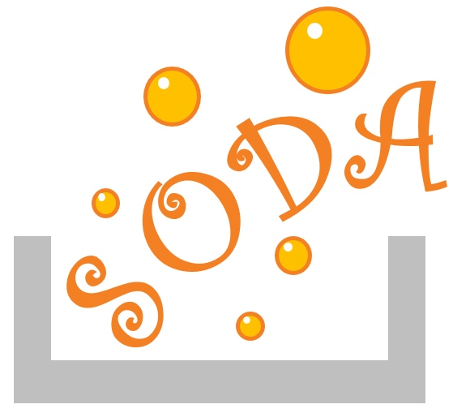

# StackOverflow-datascience-atlas (SODA)

StackOverflow is the largest online community for programers to learn, share their knowledge, and advance their career.

SODA intended to help new users understand what makes a good question on StackOverflow, and facilitate them to format their attractive questions for quick and good answers. The project uses of 160GB metadata of over 24million post questions/answers comes from open-source data avalible on Google’s BigQuery API. Supplementary data are queried from StackOverflow's official API and other open source survey.

Tired of stare at the screen search clues for debugging? Grab a cup of SODA.

