# StackOverflow-datascience-atlas (SODA)

StackOverflow is the largest online community for programers to learn, share their knowledge, and advance their career.
## 1.Introduction
StackOverflow-data science-atlas (SODA)
The project "SODA" is intended to build language facilitation app for both new registers and coding gurus to format their questions on StackOverflow. According to the exploration data analysis [(Link)](https://www.kaggle.com/zehaiwang/stackoverflow-preliminary-eda), less than 10% of new registers from 2017-18 post question  within one-year, what is more, only 3.6% percent of their posted question got accepted answers. This indicating, we should provide more insight suggestions and assistance for newbies to make them truly taking advantage of the community. Detailed data queries can be found in [this notebook](https://github.com/wangz19/Stack-overflow-datascience-atlas/blob/master/notebook/preliminary_query.ipynb)

The project uses of 160GB metadata of over 30 million post questions/answers from open-source database (2008 - Mar, 2018). The database is available on Google’s BigQuery cloud data warehouse, that kaggle provide monthly free quota to query data. Supplementary data are queried from Stack Overflow's official API and other open source survey. 

According to the recent [2018 survey](https://www.kaggle.com/stackoverflow/stack-overflow-2018-developer-survey?utm_medium=partner&utm_source=stackoverflow&utm_campaign=developer+survey+2018), a quarter of the SO users are students and over 1/3rd are from non-CS majors.

  fig.1      |       fig.2
:-------------------------:|:-------------------------:
  |  

As we can see from the following plot, the registered users are over 1 Million/year and it keep rising-up. However, if we take detailed look at the post questions, less than 10% new users post their own questions within a year. 

fig.3 User increase per year    |  fig.4 New users with their first post
:-------------------------:|:-------------------------:
  |  

We proposed to build a NLP model, provide scheme and suggestion based on raw problem (either 'Error Message" or "Problem descriptions" to format their attractive questions for a quick informative answers. Additional function, such as "automatic tagging" and "answers recommendation" can also be add-ons for the app.

## 2.What makes a good question?
This is the very first question we have to ask, in order to help the new users to ask better questions. Let's see what do we have in hand, in the queried post table, we have "Score", "View Count", "Comment counts" ,"answer counts", "Whether it accepted answer".

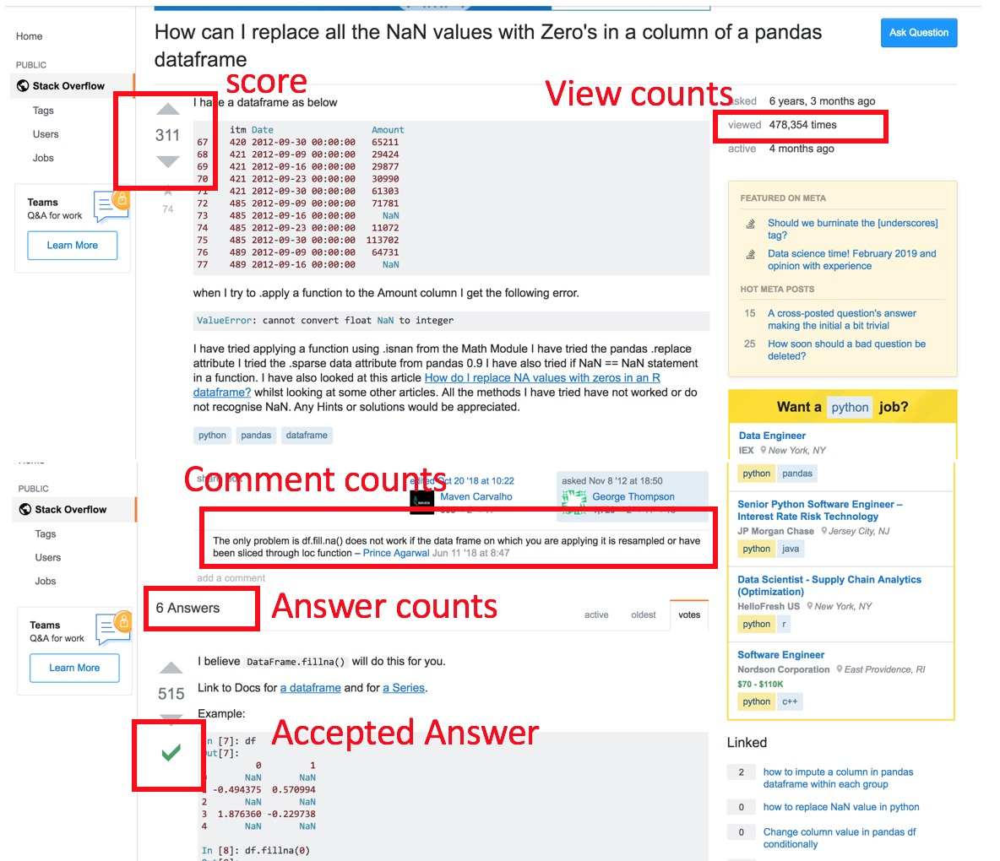

We can see that, the "Score", "View Count" have strong correlation, "answer_counts" has positive correlation to other metric. Whether a question will get satisfied answers. Interstingly, the rate to get a satisfied answer has negative relationship with comments count. It suggests that more comments indicating problems

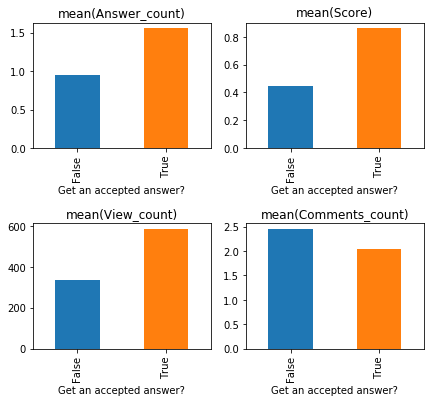

Intuitively, we would first investigate the "score", so I ploted the score using boxplot. The socre can range from -100 to 600, quite scattered distribution. I divided the questions into "good" and "bad" question.

The first thing, we see a question is the title. Investigate the n-grams feature of "good" and "bad" questions titles.

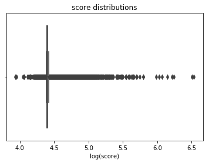

1-gram(angular, "a full stack web application frame work" got the first place in good questions, while Php, sql, C# dominate the bad questions)

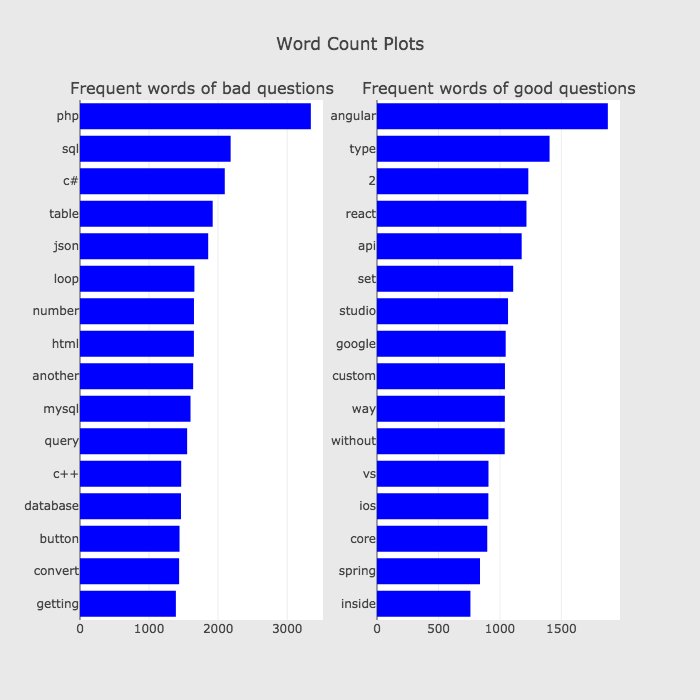

2-gram

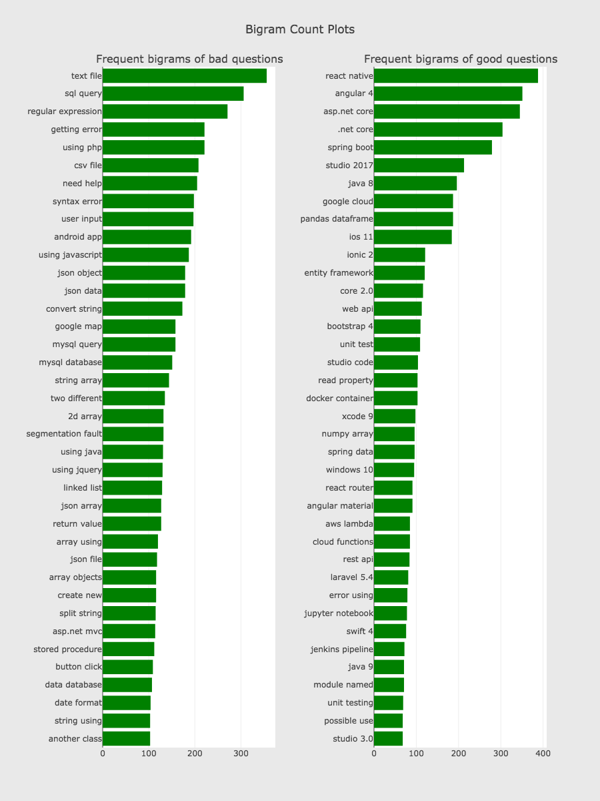

3-gram

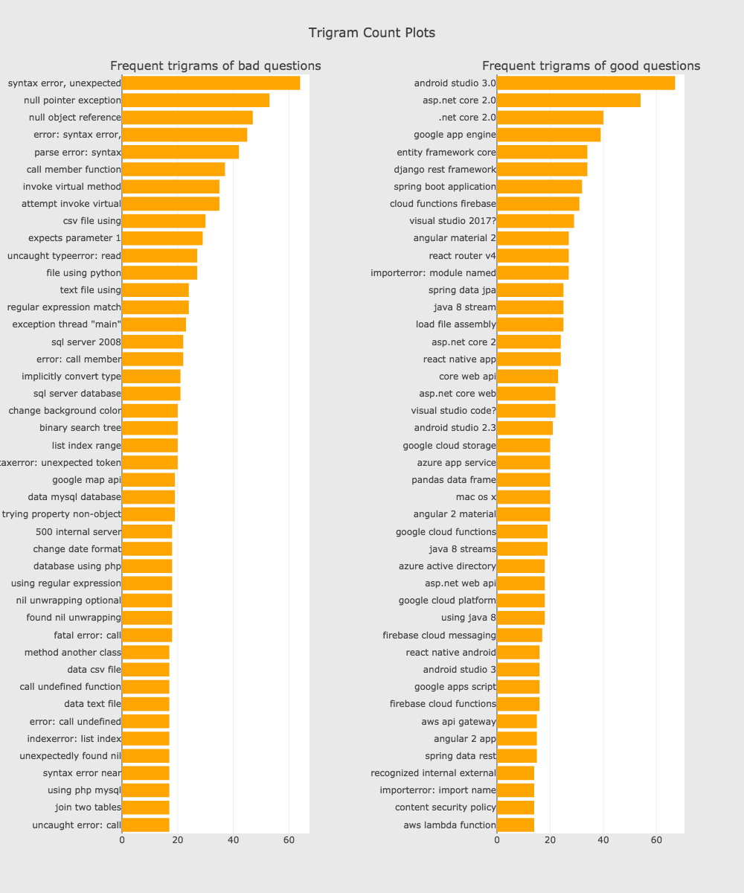

Attracting questions, view counts measures how many uses is directed into your questions. At least it seems interesting, or it represent common issues.

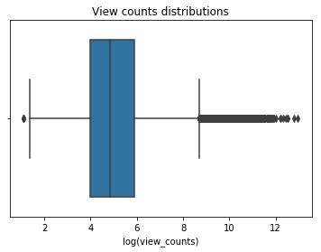

bigrams (More discriptive heavy question got lower score, seems that specified version in title)

trigram (Confirm what we found )

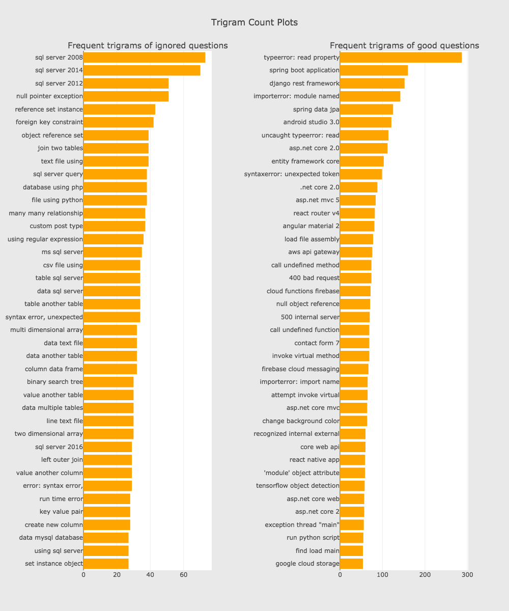

We can see that, Error massages in this case get alot more attentions, "typeError X X" and "import error" are the frequent trigram in this case. People tende to copy and paste the error massages and lead to the question. It suggest including the key work of error messages can greatly increase the attractivity of the question.

Currently, I am using a compose metric combining "number of answers" and "number of views". 
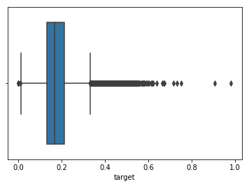

The analysis provide detailed understand on what is a good and attractive question. Current analysis is bias by the different community, detailed clustering method will be performed to bias from languages and fields. Here is a word cloud for data science related tags.

## 3. Feature Engineering
Here, we perform further EDA and feature engineering, generate meta-data related to the title, the body text. I use beautifully soup to help me clean HTML format in the body text. Details can be found in this [kaggle kernel](https://www.kaggle.com/zehaiwang/nlp-stackoverflow).

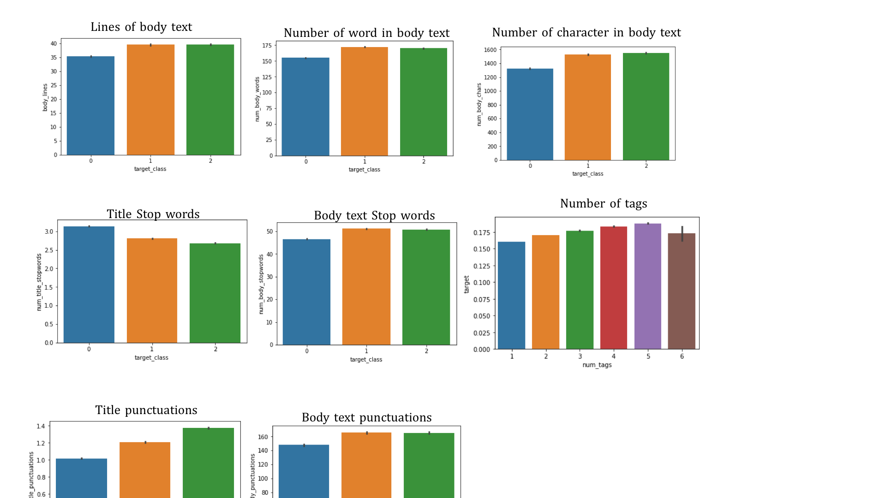

We further generate 773580 TFIDF features with sklearn TFIDF_vectorizer, and feed them into the training data_set.

## 4. Base model

I build a simple logistic regression model, currently got accuracy 0.67xx and F1 score

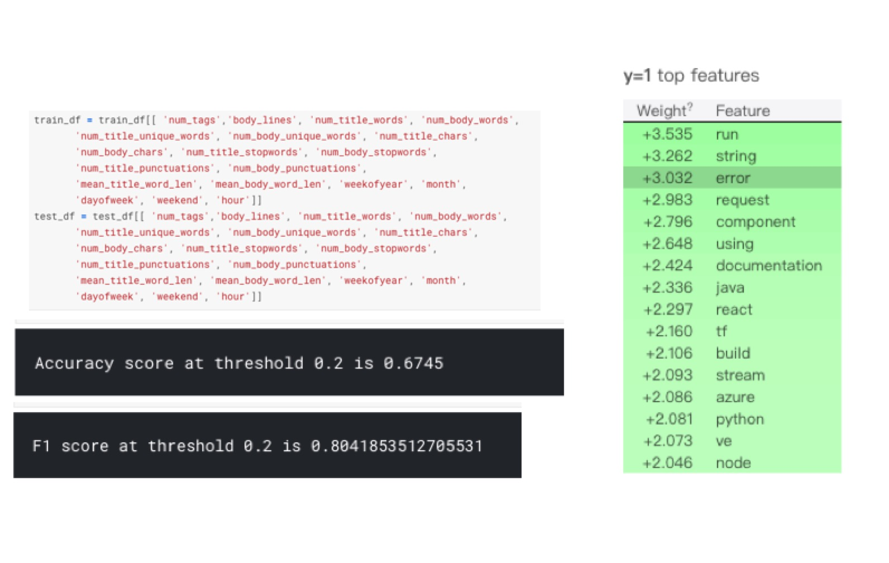

Tired of stare at the screen search clues for debugging? Grab a cup of SODA.

